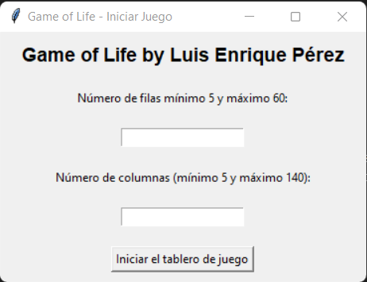
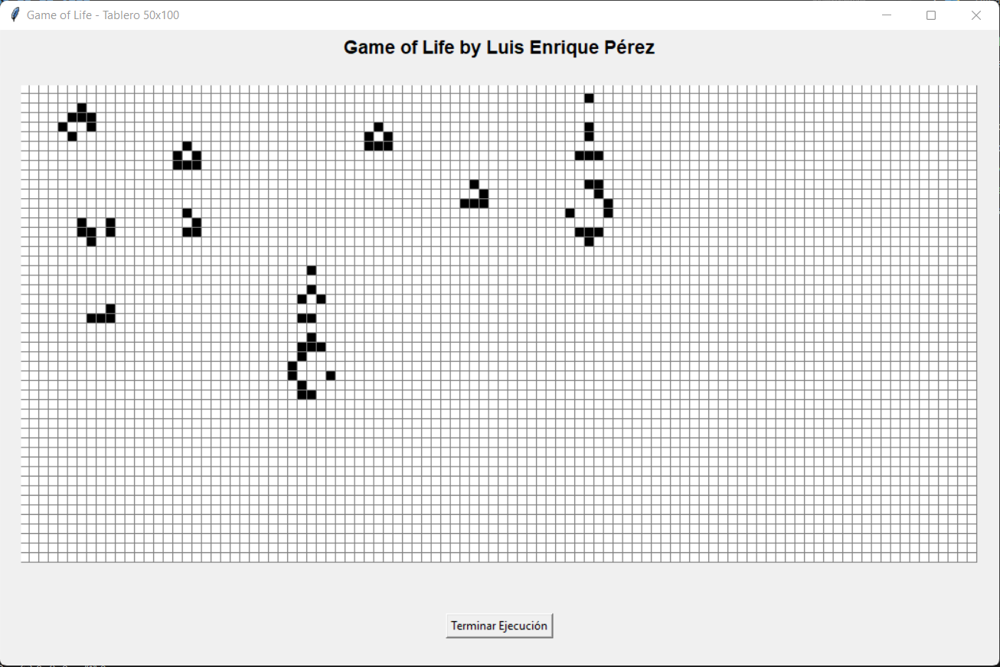

# Game of Life
The "Game of Life" is a simulation based on live and dead cells that evolve according to predefined rules. This project is an implementation in Python, and Tkinter was used for the graphical interface.

## Reasons for Choosing
I used Python due to my experience with past projects involving graphical interfaces and multiple programs using OOP. It is a language with easy readability and, above all, extensive support.

## Features
- Allows customization of the board size.
- Simulates the life cycle of cells according to Conway's classic rules.
- You can iterate step by step or execute them cyclically.

## Requirements

- Python 3.8 or higher (Python 3.12.5 was used)
- Additional Libraries: None (only Python's standard library and Tkinter are used)

### Steps to Run Unit Test 📃
To run the unit test, use:

```bash
python ./test.main.py
```
This will execute a simple unit test that inputs a matrix with an initial game state and checks that the program's output matches the expected output.

Although the test is simple, it helps verify that the console-executed program functions correctly.

### Steps to Run the Interface 💻
To launch the project interface, run the following command in your terminal:

```bash
python ./main.py
```
This will start the graphical interface.

### Steps to Run via Console ⌨️
To start the program via the console, run the following command in your terminal:

```bash
python ./main_console.py
```
Follow the console instructions to play the game.

### Execution
The interface aims to improve the program's usability.





Sample video:

<video width="720" height="540" controls>
  <source src="./assets/video_de_prueba.mp4" type="video/mp4">
  Your browser does not support video playback.
</video>

## Program Logic
The program is divided into multiple folders and files and uses **OOP**.

### Main Classes
The main classes for the program are:
- Cell.
- Matrix.
- Game of Life.
- ___Load_first._state
- ___GameEngine.

### Cell Class
The cell class contains the following:

1. Attributes:
- alive.
- neighbors.
- x_position.
- y_position.

2. Methods:
- clean_neighbors.
- add_neighbor.
- get_position.
- is_alive.
- game.
- ___game_if_alive.
- ___game_if_dead.
- born.
- kill.

The cells store their neighbors, and the **game** method checks the cell to determine if it will "be born" or "die."

### Matrix Class
The Matrix class contains:

1. Attributes:
- matrix.
- rows.
- columns.

2. Methods:
- get_size.
- generate_cells.
- print.
- get_cell.
- born_cell.
- kill_cell.

The matrix class helps manage the matrix overall, print it to the console, and manually modify the cells, which is necessary at the start of the game.

### Game of Life Class
The Game of Life class is the main class of the program.

1. Attributes:
- enter_by_console: "A boolean value to determine the execution type."
- l_alive_cells: "A list that stores the living cells."
- iterations: "An integer representing the number of iterations to run via the console."

2. Methods:
- start_game
- get_alive_cells
- set_alive_cells
- print_matrix
- get_cell "Uses the get_cell method from the matrix class."

### Load_first_state Class
This class is related to Game_of_Life and stores the logic to execute the first state.

1. Attributes:
- start: "Initializes the procedure to extract the values from the table entered via the console or the interface."
- input_matrix: "Requests the input for the first state of the table via the console."
- update_matrix: "Updates the matrix from the Matrix class using the entered table."

If the input is not from the console, then the **start** method uses the list of living cells sent from the interface.

## GameEngine Class
The class contains the main methods and attributes for running the "Game of Life."

1. Attributes:
- Game: "An instance of the Game_of_Life class."
- set_important_cells: "A set with the row and column values of important cells."  
Important cells are those that are alive or have a neighbor that is "alive."
- iterations: "Stores the iterations value from the Game_of_Life class."

2. Methods:
- game: "Starts the game by calling other functions; its behavior changes depending on whether it's console or interface execution."
- update_game: "Updates the cell instances within the Matrix class."
- count_neighbors: "Counts the neighbors of a living cell."  
The goal is to increase the number of living neighbors for both living cells and their neighboring cells.
- add_important_cells: "Adds cells to the *set_important_cells* set."
- get_neighbors: "Gets the valid neighbors of living cells, avoiding neighbors outside the table."
- cell_is_in_matrix: "Checks if a cell is inside the table."
- is_in_range: "Checks if a value is within a range, used in the *cell_is_in_matrix* method."

### Logic
These are the steps or procedures used by the program:

1. Create an instance of the Game_of_Life class.
2. When the instance starts, it creates an instance of the "Matrix" class, which initializes a double list that contains instances of the Cell object.
3. After initializing the attributes, Load_first_state.start() is executed to load the matrix values, either via the console or interface.
4. The Load_first_state.start() method will execute the console menu and allow matrix input through it if applicable; otherwise, it will use the list of living cells passed from the interface to load it into the matrix of the Matrix class and change the "is_alive" status of the Cell class instances.
5. Once the first matrix is updated, Game_of_Life.start_game() is executed, which runs *GameEngine().game()*.
6. The game will be updated using the *update_game* method to update the cells' state.
7. The number of living neighbors is counted for living cells, and the count is increased for these cells and their neighboring cells. If neighboring cells are "dead," a living neighbor is added to those cells.
8. All observed cells, living cells, and their neighboring cells are stored.
9. The *game* method of the Cell class is executed to change the state.
10. For the graphical interface, a lambda function is sent, allowing the Cell class to modify the color of the interface cells.

The properties gui_born_cell= None and gui_kill_cell= None were used within the functions so these functions could be sent from the interface through the Game_of_Life instance. Although it may be repetitive, the "None" conditions are used to prevent collisions.